## Opis aplikacji
Zaprojektowana aplikacja umożliwia organizowanie I zarządzanie zdarzeniami
w konwencji rywalizacji. Głównym założeniem było wytworzenie prostego
interfejsu do ustalania terminów, omawiania zdarzeń oraz przesyłania
projektów. Projekty po przesłaniu miały być oceniane przez wybranych przez
organizatora zdarzenia sędziów. Sędzia powinien mieć możliwość przeglądu
projektu oraz ocenę jego na podstawie predefiniowanych kryteriów. Każda
ocena miała określoną skalę, dzięki czemu aplikacja jest w stanie rozstrzygać
zwycięzców na podstawie samych ocen. W połączeniu z możliwością określenia
wagi, organizator zdarzenia ma możliwość kontroli nad wyznaczaniem
najlepszych prac. Użytkownicy na przestrzeni aplikacji mają możliwość
wymieniać się opiniami poprzez komentowanie projektów oraz oznaczanie
projektu jako interesujący. W założeniu aplikacja posiada prosty interfejs, który
umożliwia wygodne korzystanie z aplikacji. Aplikacja działa na podstawie bazy
danych oraz na podstawie wykorzystania przestrzeni dyskowej serwera w
materii przechowywania informacji. Zawiera ona system wprowadzania plików
oraz przetwarzania ich po stronie serwera. Użytkownicy, korzystając z aplikacji,
mają też możliwość zgłaszania naruszeń regulaminu. Zgłoszenie jest
rozpatrywane przez moderatora na podstawie zdefiniowanych przez
administratora reguł. Na przestrzeni jednego wydarzenia rozpatrujemy trzy
rodzaje użytkowników:

Organizator — osoba z możliwością zmiany podstawowych informacji
związanych ze zdarzeniem, takich jak data początku, końca zgłoszeń projektów,
czy też datę ogłoszenia wyników. Może także modyfikować opis oraz inne
podstawowe dane wydarzenia.

Sędzia — jest osobą asygnowaną przez organizatora. Ma możliwość
wyświetlania zgłoszonych projektów i wystawiania im odpowiednich not. Od
niego zależy która aplikacja wygra.

Uczestnik — najniższy poziom udziału w wydarzeniu, a zarazem najważniejszy.
Osoba, która zgłosi projekt na wydarzenie, automatycznie jest asygnowana jako
uczestnik. Uczestnik może wyświetlić wyłącznie zgłoszenia, które dotyczą
projektu, którego jest autorem lub jednym z autorów.

## Wymagania funkcyjne

Korzystając z aplikacji, sędzia powinien:

- mieć możliwość wyświetlenia zgłoszeń;
- mieć możliwość wyświetlenia konkretnego zgłoszenia;
- sprawdzając otrzymane zgłoszenia, musi pobierać aplikacje;
- sprawdzając otrzymane zgłoszenia, musi oceniać zgłoszenia;

Korzystając z aplikacji, organizator powinien:

- mieć możliwość tworzenia wydarzeń;
- tworząc wydarzenie, musi określić terminy;
- tworząc wydarzenie, musi nadać kryterium;
- tworząc wydarzenie, musi dodać opis;
- tworząc wydarzenie, musi wybrać sędziów;

Korzystając z aplikacji, użytkownik powinien:

- mieć możliwość przeglądania wydarzeń;
- przeglądając wydarzenia, może brać udział w wydarzeniu;
- biorąc udział w wydarzeniu, musi stworzyć zgłoszenie;
- tworząc zgłoszenie, musi przesłać zgłoszenie;
- tworząc zgłoszenie, może dodać współpracowników;
- biorąc udział w wydarzeniu, może zaktualizować zgłoszenie;

Korzystając z aplikacji, użytkownik powinien:

- mieć możliwość bycia sędzią, organizatorem lub uczestnikiem;
- mieć możliwość przeglądania projektów;
- przeglądając projekty, mieć możliwość wyświetlić wybrany projekt;
- wyświetlając wybrany projekt, mieć możliwość komentować go;

Korzystając z aplikacji, moderator powinien:

- mieć możliwość przeglądania listy zgłoszeń;
- przeglądając zgłoszenia, może wyświetlić wybrane zgłoszenie;
- wyświetlając wybrane zgłoszenie, musi ocenić zgłoszenie;
- wyświetlając wybrane zgłoszenie, może wnioskować o więcej informacji;
- oceniając zgłoszenie, może wyznaczyć karę;
- oceniając zgłoszenie, może odrzucić zgłoszenie;

Korzystając z aplikacji, administrator powinien:
- mieć możliwość przeglądania zgłoszeń o karę,
- zarządzając zgłoszonymi o karę, może wyświetlić wybrane zgłoszenie;
- wyświetlając zgłoszenie o karę, może zatwierdzić karę;
- wyświetlając zgłoszenie o karę, może odrzucić karę;
- wyświetlając zgłoszenie o karę, może odwołać karę;

## Wymagania niefunkcyjne

W ramach poprawnego funkcjonowania aplikacji system powinien:

- uruchamiać się z poziomu aplikacji webowej,
- zapewnić bezpieczeństwo użytkowania dla wszystkich użytkowników,
- posiadać intuicyjny i wygodny interfejs,
- zapewniać bezpieczeństwo przechowywanych danych,
- zapewniać niezawodność działania o każdej porze dnia,
- działać niezmiennie na różnych przeglądarkach.

## Technologie

* Java 11
* Spring Boot
* Spring Security
* Hibernate
* Thymeleaf
* PostgreSQL

## Diagram przypadków

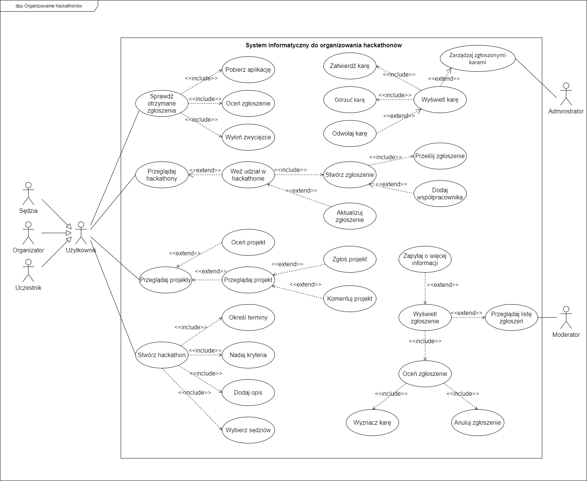

## Diagram klas

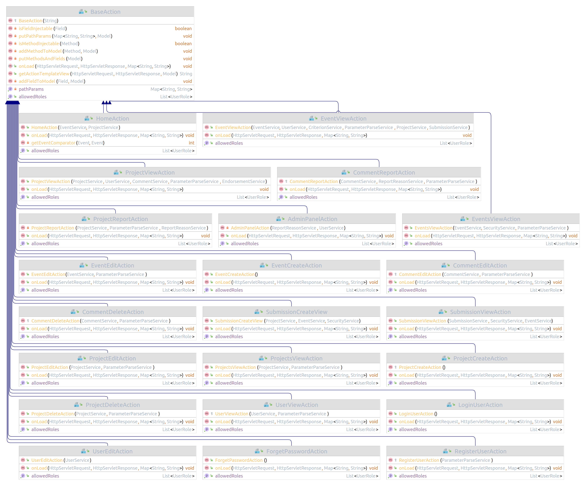
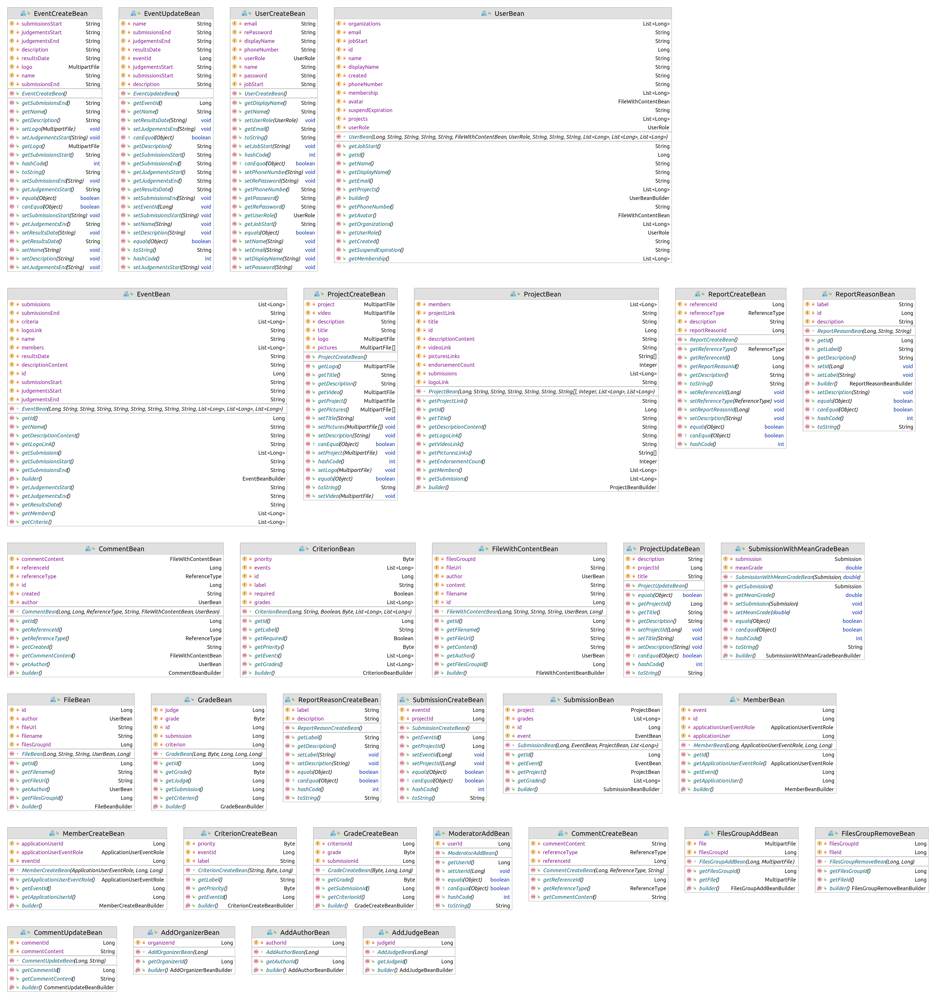
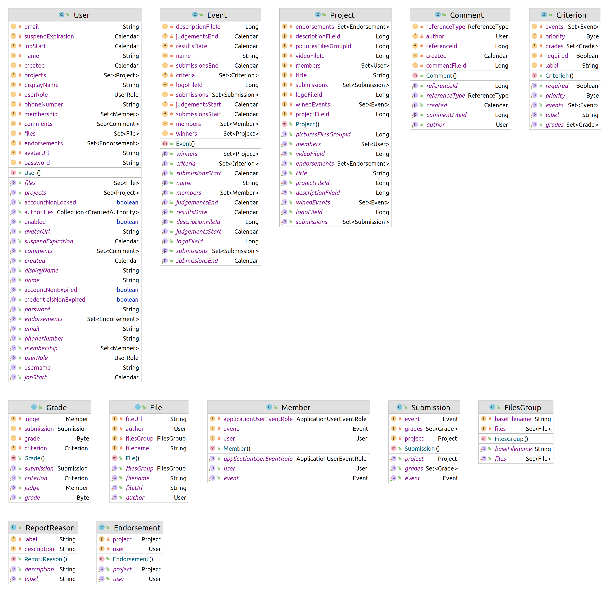
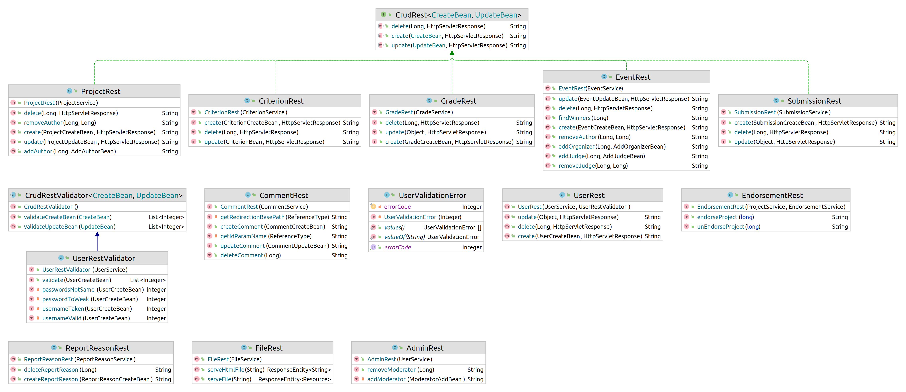
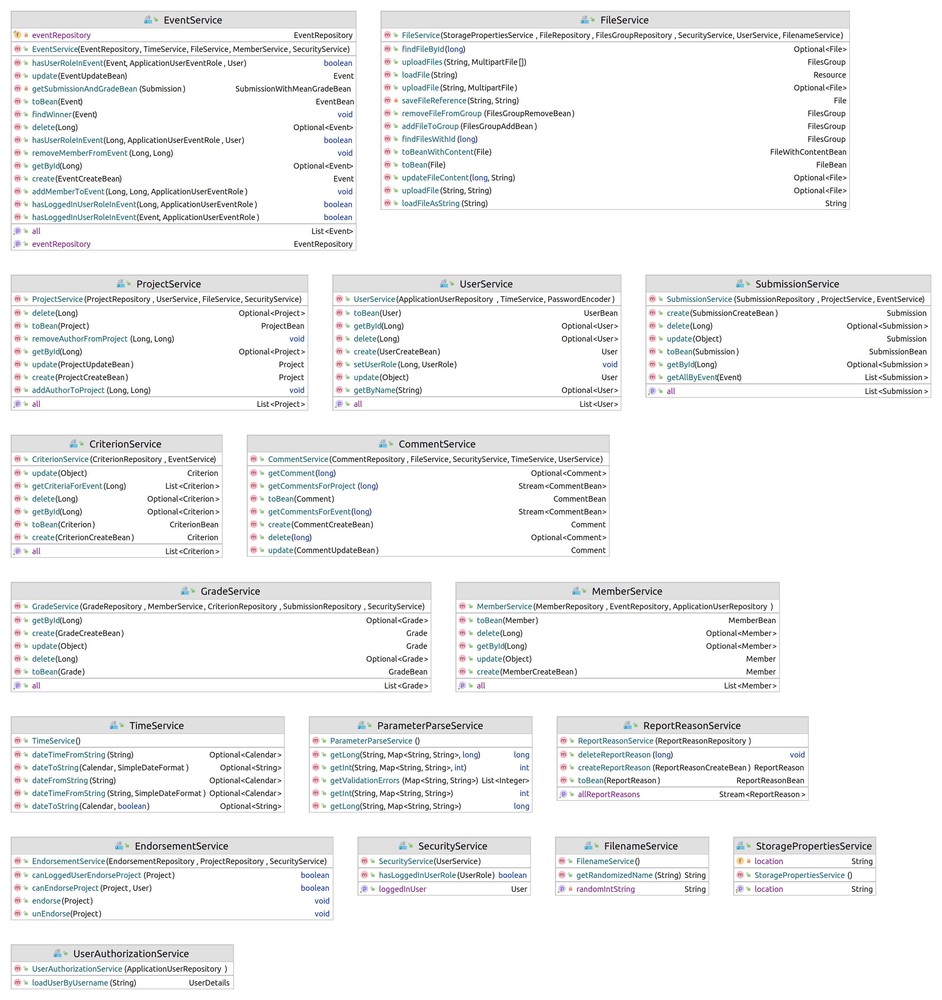

## Diagram bazy danych

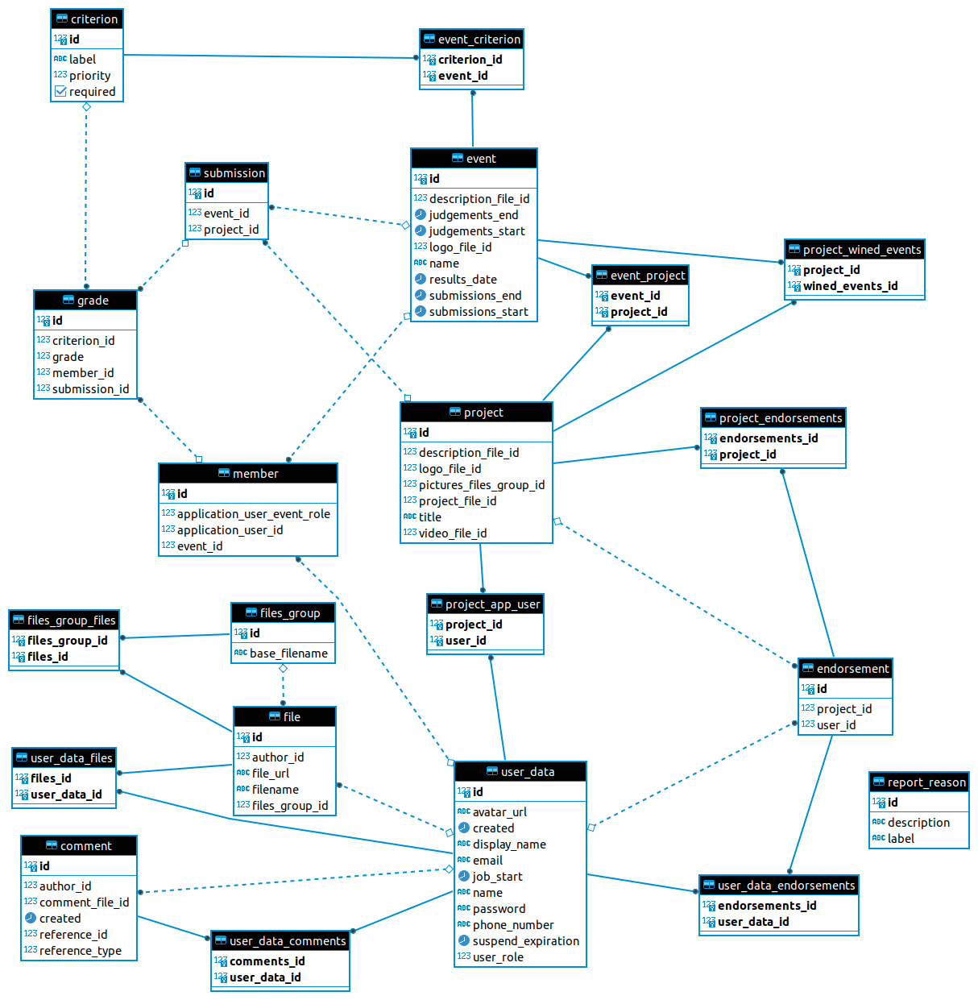

## Maszyna stanu

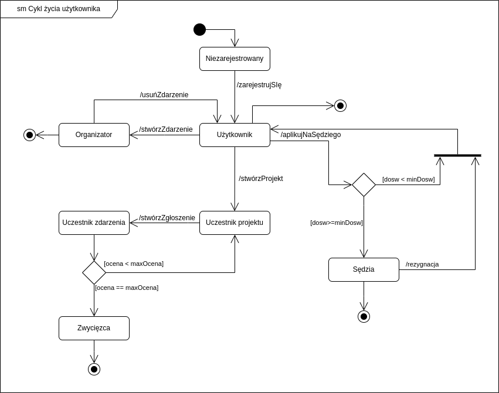

## Diagram aktywności

### Tworzenie projektu

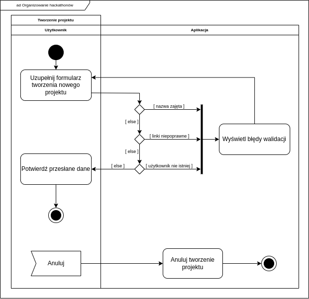

### Ocenianie projektu

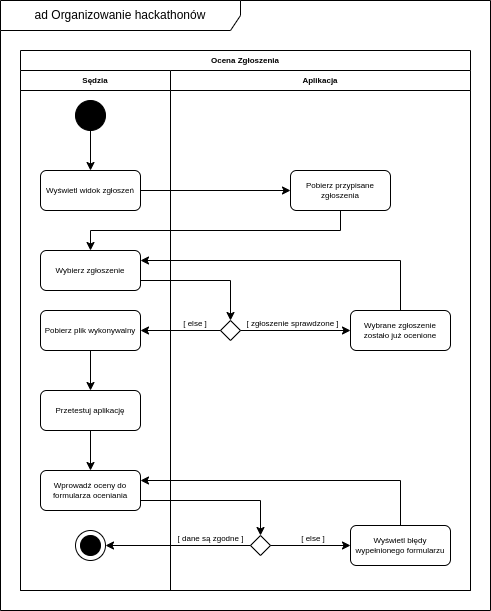

## Diagram komponentów

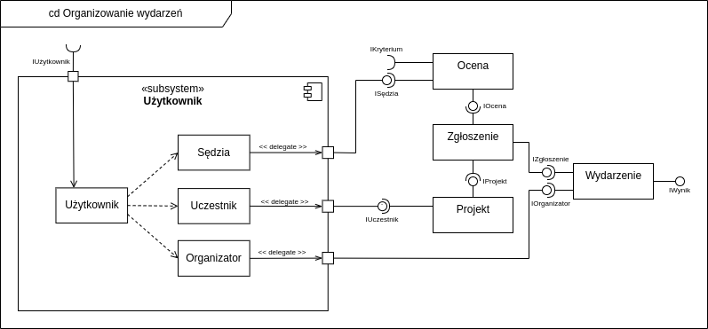

## Diagram rozlokowania

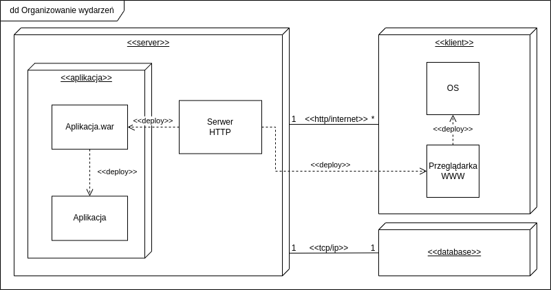

## Diagram sekwencji

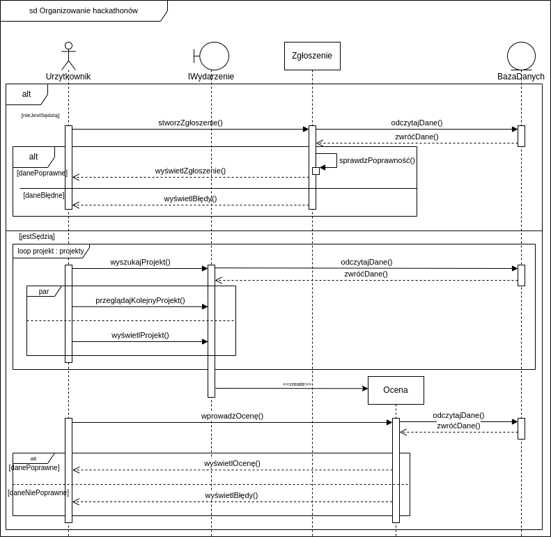